# PageIndex Experiments: Vectorless RAG vs Classic RAG

An exploratory study comparing **PageIndex** -- a vectorless, tree-based retrieval-augmented generation (RAG) approach -- against the traditional embedding + vector database RAG pipeline. The goal is to evaluate whether hierarchical document indexing with LLM-driven reasoning can replace embeddings and vector similarity for document question-answering, and to understand the trade-offs involved.

---

## Problem Statement

Classic RAG pipelines follow a well-known pattern: chunk a document, embed every chunk into a vector space, store them in a vector database (FAISS, Pinecone, etc.), and retrieve the top-k most similar chunks at query time. While effective, this approach has several fundamental limitations:

1. **Context loss during chunking** -- Fixed-size chunks break semantic boundaries. A paragraph about "Evaluation Results" might get split across two chunks, losing coherence.
2. **Irrelevant retrieval** -- Cosine similarity over dense embeddings can surface chunks that are lexically similar but semantically off-target for the actual question.
3. **No structural awareness** -- The retriever has no understanding of document hierarchy (sections, subsections, appendices). It treats a line in the abstract the same as a line in the references.
4. **Scaling cost** -- Every document requires embedding computation and vector storage, which grows linearly with corpus size.

**PageIndex** takes a fundamentally different approach: it parses a document into a hierarchical tree of sections (with titles, summaries, and full text at each node) and uses an LLM to **reason** over the tree structure to find relevant sections -- no embeddings, no vector math, no similarity search.

---

## What I Built

### Phase 1: Classic RAG Baseline (`classic_rag.ipynb`)

A standard embedding-based RAG pipeline to establish a baseline:

- **PDF Parsing**: Load a research paper (RLM -- Recursive Language Models) using `PyPDFLoader`
- **Chunking**: `RecursiveCharacterTextSplitter` with 500-char chunks, 50-char overlap
- **Embeddings**: `sentence-transformers/all-MiniLM-L6-v2` via HuggingFace
- **Vector Store**: FAISS in-memory index
- **Generation**: Llama-3.3-70B on Groq for answer synthesis
- **Retrieval**: Top-5 chunks by cosine similarity

### Phase 2: PageIndex Tree-Based RAG (`pageindex.ipynb`, `pageindex_1.ipynb`)

The PageIndex approach, developed iteratively across two notebooks:

- **Document Submission**: Upload PDFs to the PageIndex API, which returns a hierarchical tree with node IDs, titles, summaries, page ranges, and full text
- **Tree-Based Retrieval**: Instead of vector search, an LLM receives the tree structure (without full text) and reasons about which nodes are likely to contain the answer
- **Structured Reasoning**: The LLM returns a JSON with its thinking process and a list of relevant node IDs
- **Targeted Context Assembly**: Only the text from identified nodes is extracted and sent to a generation LLM
- **Dual-LLM Strategy**: A reasoning model (`stepfun/step-3.5-flash` via OpenRouter) for node selection, and a fast model (`llama-3.3-70b-versatile` via Groq) for answer generation

### Phase 3: Modular Codebase (`src/`)

Refactored the notebook experiments into production-ready modules:

- **`ingestion.py`** -- Document submission, processing status polling, tree retrieval, and local SQLite caching
- **`generation.py`** -- Tree-based retrieval pipeline with interactive chat loop
- **`db.py`** -- Database schema initialization for document metadata and tree storage

---

## Architecture

```mermaid
graph TD
    subgraph Classic RAG Pipeline
        A[PDF Document] --> B[PyPDFLoader]
        B --> C[RecursiveCharacterTextSplitter<br/>500 chars / 50 overlap]
        C --> D[HuggingFace Embeddings<br/>all-MiniLM-L6-v2]
        D --> E[FAISS Vector Store]
        F[User Query] --> D
        D --> G[Top-5 Similarity Search]
        E --> G
        G --> H[LLM Generation<br/>Llama-3.3-70B via Groq]
    end

    subgraph PageIndex RAG Pipeline
        I[PDF Document] --> J[PageIndex API]
        J --> K[Hierarchical Document Tree<br/>nodes with titles + summaries + text]
        K --> L[SQLite Cache<br/>docs.db]

        M[User Query] --> N[Tree Search Prompt<br/>tree structure without text]
        K --> N
        N --> O[Reasoning LLM<br/>stepfun/step-3.5-flash<br/>via OpenRouter]
        O --> P{JSON Response}
        P --> Q[thinking: reasoning process]
        P --> R[node_list: relevant node IDs]
        R --> S[Extract Full Text<br/>from identified nodes]
        S --> T[Answer Generation LLM<br/>Llama-3.3-70B via Groq]
    end

    style Classic RAG Pipeline fill:#1a1a2e,color:#fff
    style PageIndex RAG Pipeline fill:#0f3460,color:#fff
```



---

## Experimental Results

Both pipelines were tested on the same document (RLM -- Recursive Language Models paper) with the same generation LLM (`llama-3.3-70b-versatile` via Groq) to isolate the effect of the retrieval strategy. Full results are documented in [`pgidx_vs_classicrag_report.pdf`](pgidx_vs_classicrag_report.pdf).

### Controlled experiment configuration

| Component | Classic RAG | PageIndex RAG |
|---|---|---|
| **Answer LLM** | `llama-3.3-70b-versatile` (Groq) | Same (controlled variable) |
| **Retrieval engine** | `all-MiniLM-L6-v2` embeddings | `stepfun/step-3.5-flash` reasoning LLM |
| **Knowledge store** | FAISS vector store | Pre-built JSON node tree (`RLM_tree.json`) |
| **Chunking strategy** | Recursive character (500 chars, 50 overlap) | Logical page/section nodes (no chunking) |
| **Retrieval method** | Top-5 cosine similarity | Two-stage LLM reasoning over tree structure |

### Head-to-head question results

| Question Type | Classic RAG | PageIndex RAG | Winner |
|---|---|---|---|
| **Basic fact extraction** | Correct but slightly disjointed across chunks | Cohesive answer using full page context | PageIndex |
| **Specific detail** (table lookup) | Missed the table entirely (Science Recall@10) | Accurate retrieval from the Results section | PageIndex |
| **Analytical reasoning** | Vague fragments retrieved, incomplete answer | Comprehensive -- retrieved 8 relevant nodes | PageIndex |
| **Multi-hop reasoning** | Low performance, failed to connect related sections | High accuracy with coherent cross-section reasoning | PageIndex |

**Average answer quality: PageIndex 5.0/5.0 vs Classic RAG 3.5/5.0** (scored across 5 test questions)

### Quantitative highlights

- **28.3% median cost reduction** for complex queries with PageIndex, by avoiding retrieval of redundant overlapping chunks
- PageIndex dynamically adjusted retrieval scope: **3 nodes for simple queries, up to 8 nodes for complex analytical questions** -- classic RAG always retrieves exactly 5 chunks regardless
- On dense reasoning tasks (e.g., OOLONG-Pairs from the RLM paper), RLM-based structured retrieval achieved **F1 of 58.0%** vs **< 0.1%** for standard LLMs without structured retrieval

### Qualitative observations

- **Classic RAG strengths**: Fast, inexpensive, excellent for needle-in-a-haystack lookups within single paragraphs
- **PageIndex strengths**: Superior for queries requiring structural awareness (e.g., "compare the methodology in Section 2 with the results in Section 4"). Avoids the "lost in the middle" problem by retrieving entire logical units
- **Context coherence**: PageIndex retrieved structurally coherent, complete sections rather than fragmented 500-character chunks. Classic RAG occasionally surfaced chunks from the reference list or appendix that were lexically similar but semantically irrelevant
- **Reasoning transparency**: PageIndex's reasoning trace showed the LLM correctly identifying connections between sections (e.g., understanding that "4.1 Emergent Patterns" relates to "4. Results and Discussion")
- **Trade-off**: PageIndex has higher initial latency due to the reasoning step (two sequential LLM calls vs. one vector search + one LLM call)

### Limitations

- PageIndex depends heavily on the quality of the tree generation -- poorly structured documents produce poor trees
- The reasoning LLM can occasionally hallucinate node IDs or return malformed JSON
- Benchmarking was done on a single document with 5 questions -- results should be validated on a larger corpus

---

## What Is In Progress / Left to Explore

- [ ] **Quantitative benchmarking** -- Build an evaluation dataset with ground-truth answers
- [ ] **Multi-document support** -- Extend the pipeline to handle multiple documents with a cross-document tree index
- [ ] **Hybrid approach** -- Combine PageIndex tree selection with embedding-based re-ranking within selected nodes
- [ ] **Latency optimization** -- Explore parallel LLM calls for tree search and answer generation, or use smaller/local models for the reasoning step
- [ ] **Cost analysis** -- Measure and compare API costs per query across both approaches at scale


---

## Tech Stack

| Component | Technology |
|---|---|
| Language | Python 3.11 |
| PDF Parsing | PyPDFLoader (LangChain) |
| Chunking | RecursiveCharacterTextSplitter |
| Embeddings | sentence-transformers/all-MiniLM-L6-v2 |
| Vector Store | FAISS (CPU) |
| Tree Indexing | PageIndex API |
| LLM (Reasoning) | stepfun/step-3.5-flash via OpenRouter |
| LLM (Generation) | Llama-3.3-70B via Groq |
| Database | SQLite |
| Framework | LangChain, OpenAI SDK |
| Environment | python-dotenv |

---

## Project Structure

```
pageindex-exp/
├── classic_rag.ipynb          # Baseline: embedding + FAISS RAG pipeline
├── pageindex.ipynb            # Experiment 1: PageIndex tree generation + retrieval
├── pageindex_1.ipynb          # Experiment 2: refined PageIndex chatbot with reasoning trace
├── src/
│   ├── __init__.py
│   ├── ingestion.py           # Document submission, polling, tree caching
│   ├── generation.py          # Tree-based retrieval + interactive chat loop
│   └── db.py                  # SQLite schema initialization
├── RLM.pdf                    # Test document: Recursive Language Models paper
├── RLM_tree.json              # Cached PageIndex tree for the RLM paper
├── document-structure-*.json  # Cached PageIndex tree (alternate document)
├── pgidx_vs_classicrag_report.pdf  # Generated comparison report
├── requirements.txt
├── .env                       # API keys (not committed)
└── .gitignore
```

---

## How to Run

### Prerequisites

- Python 3.11+
- API keys for: PageIndex, OpenRouter, Groq

### Setup

```bash
# Clone the repository
git clone https://github.com/yourusername/pageindex-exp.git
cd pageindex-exp

# Create and activate virtual environment
python -m venv .venv
.venv\Scripts\activate        # Windows
# source .venv/bin/activate   # macOS/Linux

# Install dependencies
pip install -r requirements.txt
```

### Configure environment variables

Create a `.env` file in the project root:

```env
PAGEINDEX_API_KEY=your_pageindex_api_key
OPENROUTER_API_KEY=your_openrouter_api_key
GROQ_API_KEY=your_groq_api_key
```

### Run the Classic RAG baseline

Open `classic_rag.ipynb` in Jupyter and run all cells. This will:
1. Load and chunk the RLM paper
2. Build embeddings and a FAISS index
3. Run a sample query and display the answer with source pages

### Run the PageIndex pipeline

**Option A: Notebooks**

Open `pageindex_1.ipynb` for the refined chatbot experience. The notebook loads the cached tree from `RLM_tree.json` and starts an interactive Q&A loop.

**Option B: Modular scripts**

```bash
# Step 1: Ingest a document (submits to PageIndex, polls for completion, caches tree)
python src/ingestion.py

# Step 2: Start the interactive chatbot
python src/generation.py
```

The chatbot will:
1. List all completed documents in the local database
2. Prompt you to select one
3. Start a Q&A loop where you can ask questions about the document

---

## Development Journey

This project followed an iterative, experiment-driven development process:

1. **Started with Classic RAG** (`classic_rag.ipynb`) -- Built a standard pipeline to understand the baseline behavior and limitations
2. **Explored PageIndex API** (`pageindex.ipynb`) -- Submitted the same document to PageIndex, explored the tree structure, and manually tested retrieval
3. **Built the reasoning pipeline** (`pageindex_1.ipynb`) -- Implemented the two-stage LLM approach (tree reasoning + answer generation) with a full interactive chatbot
4. **Added caching** -- Introduced SQLite to avoid redundant API calls and store tree structures locally
5. **Refactored into modules** (`src/`) -- Separated ingestion, generation, and database concerns into clean, reusable modules
6. **Generated comparison report** -- Ran both pipelines on the same questions and compiled findings into `pgidx_vs_classicrag_report.pdf`

---

